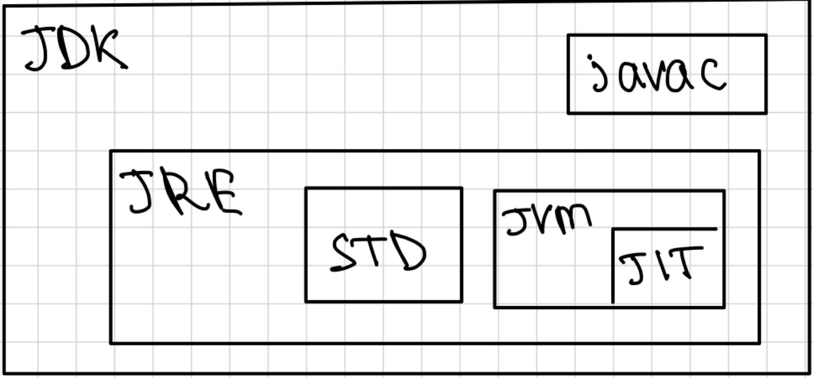

## Содержание
1. Как устроен запуск программы на java
2. конкатенация строк `+` и `concat()`
3. Что за объекты System._**out**_ и System._**in**_ при передаче в сканер и выводе в консоль.

### 1. Как устроен запуск программы на java
1. Для запуска любой программы необходим компилятор - исполняемый файл, приложение,
которое:
   1. читает исходный код, выполняет какие-то необходимые оптимизации (например, удаление неиспользуемого кода,
      встраивание тела функции, вместо ее вызова и так далее) 
   2. преобразует его в:
      - машинный код (для компьютера)
      - bytecode - промежуточное состояние в виде построчных команд, которые потом читаются **интерпретатором**
2. Интерпретатор - читает исходный илм byteCode(в случае Java) строку за строкой и преобразует его в машинный код

\* **в случае java**:
- компилятор - **javac** - содержится в **jdk**
- интерпретатор - **jvm** - также содержится в **jdk**

Собственно чтобы все запустилась у нас должен быть установлен **JDK** (Java development kit)  

- JDK - java development kit - по факту набор исполняемых файлов и библиотек для запуска программ.

**JDK** включает в себя:
- компилятор javac
- среду исполнения **JRE** - java runtime environment - минимальная реализация виртуальной машины которая позволяет
запускать и исполнять программу
- **JRE** состоит из 
  - библиотек (std)
  - **JVM**, которая исполняет скомпилированный байт-код
    - JVM содержит **JIT** - just in time компилятор 
    - Как работает JIT в Java:
      - Ты запускаешь Java-программу → JVM читает байткод.
      Сначала код интерпретируется построчно (медленно).
      Когда JVM видит, что некий участок кода выполняется много раз (например, цикл или метод), она передаёт его JIT-компилятору.
      JIT компилирует этот байткод в нативный машинный код и сохраняет его.
      Следующие вызовы этого кода уже не интерпретируются, а запускаются напрямую в машинной форме → быстрее.

Разберем пример последовательно:
1. Мы написали программу - нажали кнопку запустить или build или как-то там задеплоили
2. Javac скомпилировал ее в байт-код (набор исполняемых инструкций) с расширением **.class**
3. Запуск проекта подразумевает его **build** (сборку) - компановку скомпилированных файлов (**.class**)
в архив с расширением **.jar**
4. После запуска jar-файла программа начинает работать, а jvm построчно выполняет байт-код, который там написан
5. Если jvm видит, что участок кода (команда/набор команд) выполняется часто по мере работы программы, то
JIT-компилятор прямо во время работы программы преобразует его в машинный код и в дальнейшем при вызове
команды будет миноваться процесс компиляции в машинный код.

Изначально при запуске программы (например на сервере) она пребывает там в смешанном состоянии (машинный + байт-код)
и по мере работы может быть почти полностью переведена в машинный код.

### 2. конкатенация строк `+` и `concat()`
- `concat()` работает с только со `String` и выдает ошибку при передаче `null`
- `+` работает с любыми типами и `null` при условии, что один из аргументов `String`
- `String` как правило храниться в куче, в области именованной `String pool`
- `StringBuilder` - не потокобезопасный, в отличие от `StringBuffer`, внутри использует массив `char[]`
он не создает новый объект в отличие от строк, потому что они иммутабельны, поэтому работает 
гораздо быстрее.

### 3. Что за объекты System._**out**_ и System._**in**_ при передаче в сканер и выводе в консоль.
#### 🔹 класс `InputStream`  (объект System.in)

Это **абстрактный класс**, представляющий **поток байтов для ввода**.
- Расположен в пакете `java.io`.
- Используется для **чтения байтов** из различных источников — клавиатуры, файлов, сети и т.д.
- Ключевые методы:
  ```java
  int read(); // читает один байт
  int read(byte[] b); // читает массив байтов 
  ```

### 🔹 `PrintStream` (объект System.out)

Это **конкретный подкласс `OutputStream`**, предназначенный для **удобного вывода текста и данных**.

- Находится в пакете `java.io`.
- Расширяет `FilterOutputStream`, который, в свою очередь, расширяет `OutputStream`.
- Главное отличие от базовых потоков вывода — наличие методов `print()` и `println()` для вывода различных типов данных (строки, числа и т.д.).
- Используется для **текстового вывода в консоль**, файлы или другие выходные потоки.

Почему BufferedReader быстрее?

- Буферизация:
BufferedReader использует внутренний буфер (обычно 8192 символа), что снижает количество обращений к диску или вводу-выводу (I/O).
Вместо чтения по одному символу или байту, данные читаются пачкой (блоком), что значительно уменьшает накладные расходы.


- Минимум обработки:
BufferedReader не анализирует содержимое, а просто читает текст.
Scanner, напротив, анализирует входные данные (разбивает по токенам, пытается распознать типы — числа, слова и т.д.), что требует дополнительной обработки и затрат процессора.
Лучше подходит для больших файлов:
При чтении больших текстовых файлов, особенно строка за строкой, BufferedReader показывает значительно лучшую производительность, чем Scanner.

- ✅ Когда использовать BufferedReader, а когда Scanner 
  - Используйте BufferedReader, если:
    - для алгосов, когда читаем длинные строки
    - Вам нужно просто и быстро читать строки (например, из файла).
    Вы работаете с большими объемами данных.
    Вы контролируете разбор (например, сами парсите строки в числа и т.д.).
  - Используйте Scanner, если:
    - Вы читаете простые, структурированные данные (например, CSV, числа и слова).
    Удобство важнее производительности.
    Данные небольшие, и накладные расходы не критичны.

```java
        public static void main(String[] args) {
// Создаем BufferedReader для чтения с консоли (System.in)
            try (BufferedReader reader = new BufferedReader(new InputStreamReader(System.in))) {
                System.out.print("Введите строку: ");
                String line = reader.readLine();  // Читаем строку
                System.out.println("Вы ввели: " + line);
            } catch (IOException e) {
                e.printStackTrace();
            }
        }
```